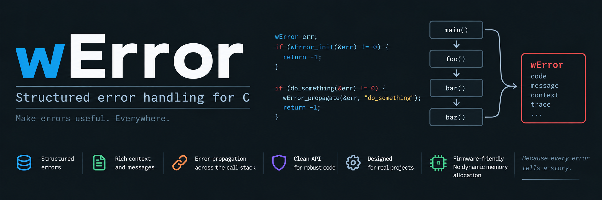

# Generic exception handling libraby for C language

## 1.0 Files

|    Files/Dirs    |                     Description                           |
|------------------|-----------------------------------------------------------|
| images           | This folder contains picture used by the RADME.md files   |
| LICENSE-LGPL3.md | LGPL 3 licence                                            |
| codeGen          | It contains the script that generates the main() function |
| src              | This dir contains the C source code                       |
| tools            | External tools (eg.winstall)                              |
| doc              | Software documentation                                    |
| share            | Project's files (eg. install scripts) and others          |
| Changes.md       | Software changes for every relese                         |
| TODO.md          | Next features do develop                                  |
| winstall.conf    | Installation process configuration file                   |

## 2.0 Decription
Delegation and separation of responsibilities are fundamental principles in software development. But how can we preserve them
when we need to report unexpected behavior?

Consider a very simple example: an error occurs inside a function, while error reporting and message presentation are managed by
the caller (main()), for example.

### First solution: return an error code
The function can return a numeric error code and leave main() responsible for associating that code with an appropriate message.

This is simple, but it is also a poor design.

The function where the error occurs is the component that has the knowledge required to describe the problem, not main().
Moving that knowledge into **the caller breaks the separation of responsibilities**.
It also tends to produce ugly code, because main() may eventually requires a large "switch" statement just to translate error
codes into messages.

### Second solution: print the message directly

The function can print the error message itself.

This is quick and not necessarily ugly, but it introduces another problem. If main() is the component responsible for message
presentation (standard output, syslog, remote alarms, logging systems, and so on) then the called function is now performing a
task that does not belong to it.

**Once again, responsibilities become mixed**.

### Third solution: return the error through a double pointer

Another common approach is based to pass a double pointer as an additional argument.
If it is not "NULL", the called function can dynamically allocate an error object or message and return it through that pointer.
This is a good solution from an architectural point of view because the function can provide detailed information without deciding
how that information will eventually be presented.

This pattern is widely used. Examples include GLib's "GError \*\*" and the "char \*\*errmsg" argument used by sqlite3_exec().

However, it has some drawbacks: dynamically allocated memory must eventually be released, ownership rules must be clearly defined,
and APIs become slightly heavier.

### The wError solution
wError takes a different approach, conceptually inspired by C++ exception handling while remaining entirely within C.
A wError value contains a common section holding information such as the numeric error code and the error-type identifier.
Depending on the error type, an additional specialized section can carry information specific to that error.
That information does not have to be limited to a string. It can contain messages, callbacks, arrays, structures, or other
application-specific data.

The function that detects the problem therefore remains responsible for describing it, while the caller remains responsible for
deciding what to do with that information.

At the same time, the API does not require an additional error-output argument and no dynamic memory allocation is needed.

This makes wError particularly suitable for firmware and embedded software, where deterministic memory usage and lightweight
APIs are often important requirements.

## 3.0 How does wError work?
To provide polymorphic behavior in C, the `wError` structure uses a `union`.
The `error-type` field acts as a discriminator: both the library and the user can use it to determine how the data stored inside
the union must be interpreted and handled.

This approach allows `wError` to support different error types without requiring dynamic memory allocation, while keeping the
memory overhead very low.

The library is also designed to be easily extensible without modifying its core code. New custom error sub-modules are 
integrated at compile time through metaprogramming techniques.

In this way, applications can define their own specialized error types while preserving the same common `wError` interface.

## 4.0 How to install wError library
In order to avoid to create the common INSTALL script to install and remove minute software, I have created the winstall
sub-module. It allows you to install and remove the package in easy way. The **winstall.sh** file should be located in the
toows/winstall folder. If the folder is missing, then you have to clone the sub-module with the following command:

	git submodule update --init --recursive

When you bave downloaded the sub-module, you can install mionute with the following command:

	sudo ./tools/winstall/winstall.sh --cmd=install --verbose

For further information on this tool, please, read the [winstall project's page](https://github.com/catinella/winstall)

[!] The default prefix is /usr/local

## 5.0 TODO
[TODO](TODO.md)

## 6.0 Changes
[CHANGES](Changes.md)

## 7.0 License

This project is free software, released under the terms of the **GNU Lesser General Public License, version 3 (LGPL-3.0)**.

You are free to use, modify, and redistribute this software in accordance with the terms of the license, including its use
as part of proprietary software, provided that the LGPL-licensed components and any modifications to them remain compliant
with the LGPL-3.0 requirements.

For the complete license terms, please refer to the [LICENSE-LGPL3.md](LICENSE-LGPL3.md) file included with this project.

Copyright © Silvano Catinella
